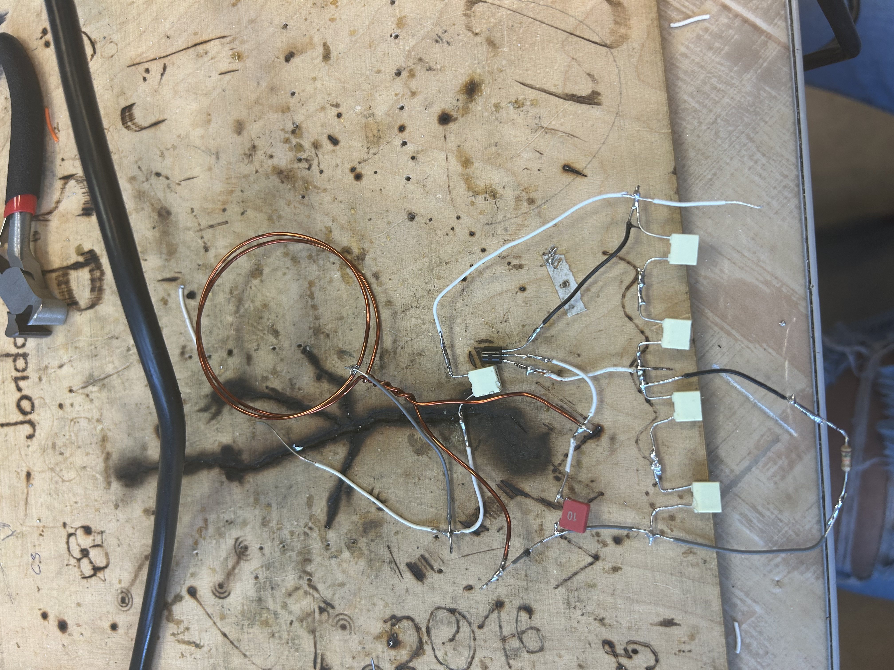
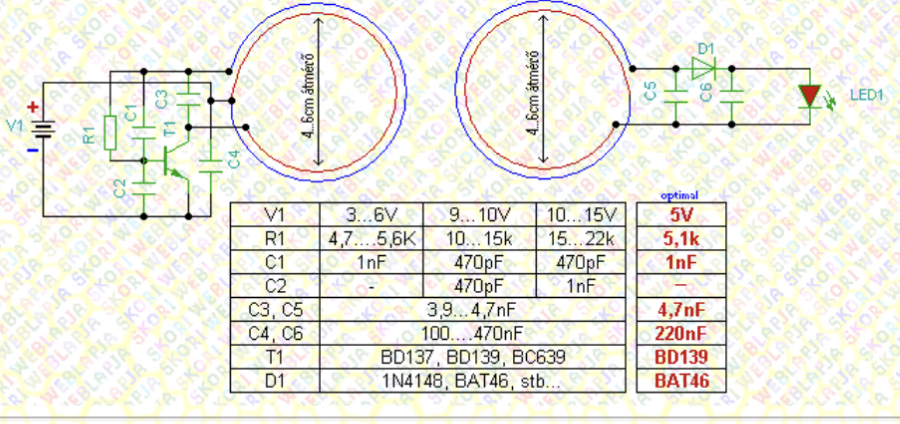

# Vezeték Nélküli LED áramkör építési projekt 2023.02.10

A vezeték nélküli led kapcsolási rajza:

A saját Munkám működőképes,sajátosan valasztott eszközökkel 

A vezeték nélküli led

Elkészítése:
A vezeték nélküli ledet órán készítettem 
körülbelűl az elkészítése 7 45perce órát vett igénybe 
A forrasztást magam oldottam meg ezt tanárúr kötelezte nekünk hogy minnél jobb és szebb forraszást tudjunk csinálni a késöbbiekben 
A tekercset saját magunk tekertük meg ez volt a feladat legkönnyebb része

A Használt eszközök:

Ez alapján dolgoztam innen néztem a eszközöket 

